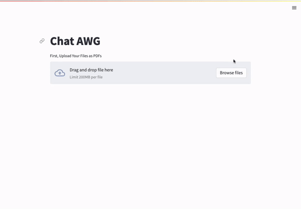

# Chat-AWG
Team Odin Hacking For Defense 

# Running 
1. Git Clone this Repo
2. Activate the "myenv" venv
3. Run pip install -r requirements.txt
4. Add your OPENAI API key to a new file called .env as follows: OPENAI_API_KEY="sk-abc"
5. Run "streamlit run frontend.py"

